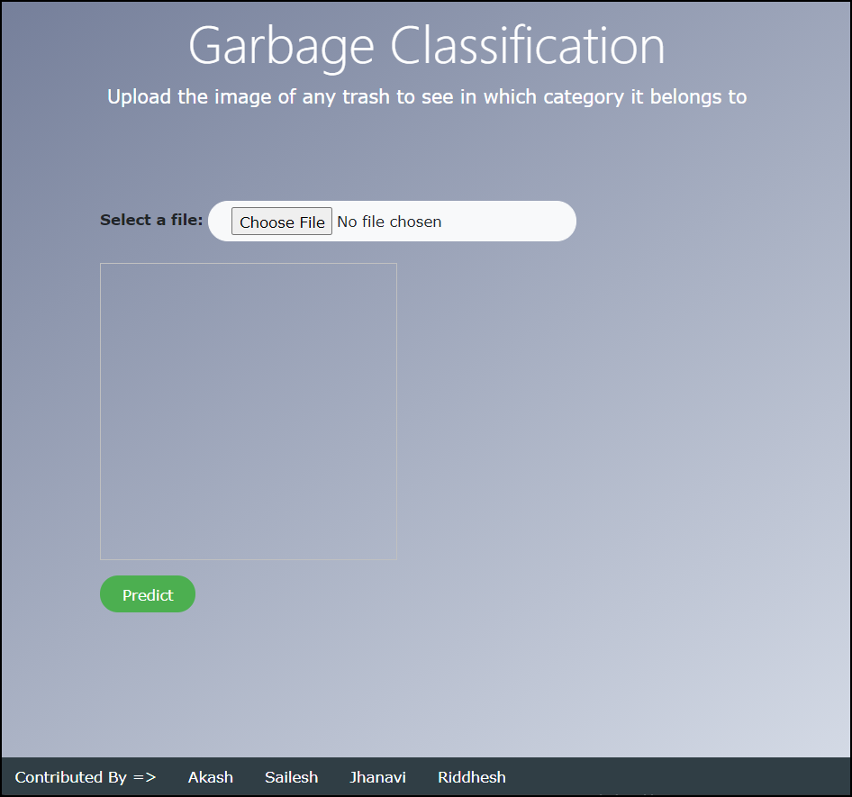

# Regex Internship Final Project using CNN
## Project Description:
  A computer vision approach to classifying garbage into recycling categories could be an efficient way to process waste. Recycling is already a significant work for all countries. Among the work needed for recycling, garbage classification is the most fundamental step to enable cost efficient recycling. The objective of this project is to take images of a single piece of recycling or garbage and classify it into on out of six classes consisting of glass, paper, metal, plastic, cardboard, and trash. 

## Team :
- [Sailesh Nair](https://www.linkedin.com/in/nairsailesh/)
- [Akash Kokare](https://www.linkedin.com/in/akash-kokare-410961173/)
- [Jhanavi Behl](https://www.linkedin.com/in/jhanavi-behl-7a43301a8/)
- [Riddhesh Khedekar](https://www.linkedin.com/in/riddhesh-khedekar-a13001191/)

## Models:
Created our own Sequential Model. 
Tried pre trained models 
- VGG16, 
- VGG19, and 
- InceptionV3
## Screenshot of the Site:

## Drawbacks
The accuracy of the whole system majorly depends on the dataset used for classifying purposes. As trash can consist of a wide range of items that also appear different depending on how, when and for how long they have been disposed of, the dataset we use has some limitations. To increase the accuracy of our system, more real data of actual piles of garbage are also required to train our model better.
